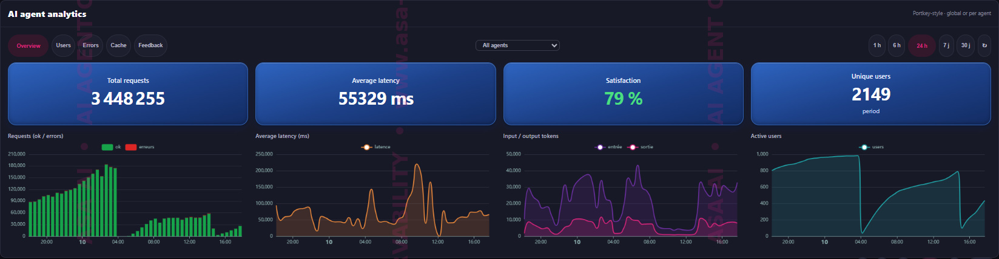


🌐 <b>English</b> · <a href="README.fr.md">Français</a> · <a href="README.es.md">Español</a>

# ASA AI — AI Security & SOC Automation

**Securing AI systems and automating defense — from LLM red teaming to VoIP threat detection.**

---

## 🆕 AI Agent Observability — *Your AI agents are talking. Are you listening?*

Every call, every token, every error, every blocked prompt: **one live view of everything your AI agents do in production.** Performance, cost, reliability, cache efficiency, user satisfaction and ASA-AI-Guard security decisions, for all your agents and models, cloud or self-hosted.

---

## 🎯 What I work on
I build and evaluate security for AI systems, and I automate the SOC around them. Six focus areas:

| Axis | Domain |
|---|---|
| 🛡️ | **VoIP security & SIP audit** — fraud detection, VoIP service auditing, SIP pentesting |
| 🤖 | **MCP-orchestrated defense** — Model Context Protocol for detection & response |
| ⚔️ | **AI-driven offensive** — LLM red teaming, prompt injection, agentic attack chains |
| 📊 | **AI agent evaluation** — robustness, multi-turn degradation, observability |
| 🔎 | **AI workflow / LLMOps evaluation** — guardrails, model scanning, supply chain |
| 🔁 | **CI/CD pipeline security** — SAST/SCA, artifact signing, pipeline security |

## 🚀 Flagship projects
- 📈 **[ASA AI Agent Observability](https://khemegha.github.io/khemegha/observability/)** — live monitoring of AI agents: calls, latency, tokens, errors, cache and Guard decisions.
- 🛰️ **[ASA-AI-VoIP-Threat-Sentinel](https://github.com/khemegha/ASA-AI-VoIP-Threat-Sentinel)** — real-time threat detection for VoIP/SIP services.
- 🛡️ **[ASA-AI VoIP Security Audit](https://github.com/khemegha/ASA-AI-VoIP-Audit)** — SIP/VoIP penetration testing (NIST SP 800-115) with branded reports.
- 🧠 **ASA AI SOC Analyst** — AI agent for SOC automation (triage, correlation, response).
- 🔐 **MCP Security** — hardening and evaluation of Model Context Protocol servers.
- 🎓 **[ASA AI Formation](https://github.com/khemegha/asa-ai-formation)** — AI & VoIP security training.

## 🧰 Stack & tools
**AI Security:** PyRIT · Garak · NeMo Guardrails · Arize Phoenix · LangGraph · MCP
**VoIP / SIP:** Asterisk · Kamailio · OpenSIPS · Homer · sippts · SIPVicious
**SOC / Blue Team:** Wazuh · MISP · Shuffle (SOAR) · DFIR-IRIS

## 📬 Contact
**ASA AI** · AI Security & SOC Automation · Île-de-France, France
📩 **contact@asa-ai.fr** · 🌐 **[asa-ai.fr](https://www.asa-ai.fr)** · 💼 **[LinkedIn](https://www.linkedin.com/in/asa-ai-101815430/)**
